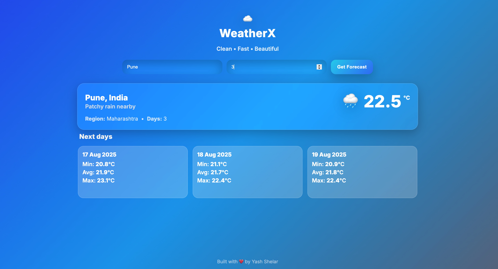
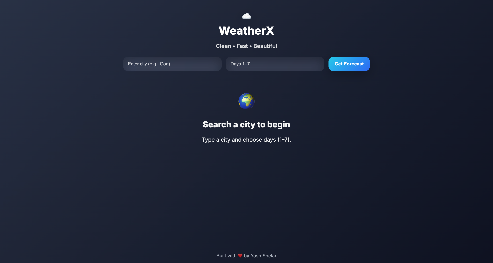

🌤️ WeatherX - Weather App

A modern and responsive **Weather Forecast Application** built with HTML, CSS, and JavaScript.  
It fetches real-time weather data (current & forecast) using a backend API built with Spring Boot, and displays it with a clean, attractive UI.

---

🚀 Features:
- 🌍 Search weather by city  
- 🌡️ Shows current temperature, condition, and location  
- 📅 7-day forecast with min, max, and avg temperatures  
- 🎨 Gradient background changes dynamically  
- 📱 Responsive design (works on desktop & mobile)  
- ⚡ Deployed on GitHub Pages  

---

🖼️ Screenshots:
Home Page:


Forecast View:
  

---

🛠️ Tech Stack:
- Frontend: HTML, CSS, JavaScript  
- Backend: Spring Boot (REST API)  
- API: [Weather API](https://www.weatherapi.com/)  
- Deployment: GitHub Pages  

---

📦 Installation & Usage:

1. Clone the repo:
   ```bash
   git clone https://github.com/theyashshelar/weather-app.git
   cd weather-app

2. Open index.html in a browser.

3. For backend API (Spring Boot), start your server:
    mvn spring-boot:run
    API will run at http://localhost:8080/weather.


📌 Future Enhancements:
🌙 Dark mode toggle
🗺️ Show weather on an interactive map
💨 Show wind, humidity, and sunrise/sunset times
🔔 Weather alerts & notifications


👨‍💻 Author:

Your Name: 
Yash Shelar
📧 yashshelar006@gmail.com
- 💻 [GitHub](https://github.com/theyashshelar) 

---

⭐ If you like this project, give it a star!
